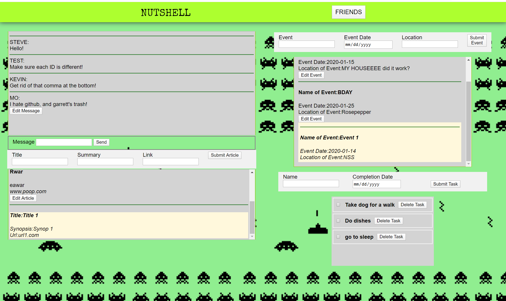

# Nutshell: Alien Hunters
## Creators (Callous Capybara)
1. Garrett Freshwater
1. Kevin Penny
1. Aja Washington
1. Namita Manohar
# Nutshell Overview 

Nutshell is a dashboard for people to organize their daily tasks, events, news articles, friends, and chat messages.
These are all of the skills and concepts that Callous Capybara used to create Nutshell.

1. Functions
1. Databases/API
1. Github
1. Objects
1. CSS
1. Handling user events
1. Array/object methods
1. Data entry/editing
1. Modular code
1. Relational data
1. Session Storage

## How to Launch Nutshell
1. Clone the repository from Github
1. Open your terminal and type the command "npm install" to install Webpack
1. In the main project directory, create a new directory called "API"
1. In the API directory, create a file called "database.json"
1. Copy the sample data below into database.json
1. In the terminal, type the command "npm start". You are now ready to use Nutshell!
## Sample Data
```json
{
  "users": [
    {
      "id": 1,
      "email": "steve",
      "password": "steve"
    },
    {
      "id": 2,
      "email": "mo",
      "password": "mo"
    },
    {
      "email": "leah",
      "password": "leah",
      "id": 3
    },
    {
      "email": "test",
      "password": "test",
      "id": 4
    },
    {
      "email": "last",
      "password": "last",
      "id": 5
    },
    {
      "email": "kevin",
      "password": "kevin",
      "id": 6
    },
    {
      "email": "aja",
      "password": "aja",
      "id": 7
    }
  ],
  "messages": [
    {
      "id": 1,
      "userId": 1,
      "message": "Hello!"
    },
    {
      "id": 2,
      "userId": 4,
      "message": "Make sure each ID is different!"
    },
    {
      "id": 3,
      "userId": 6,
      "message": "Get rid of that comma at the bottom!"
    },
    {
      "id": 4,
      "userId": 2,
      "message": "I hate github, and garrett's trash!"
    }
  ],
  "news": [
    {
      "id": 1,
      "userId": 1,
      "title": "Title 1",
      "url": "url1.com",
      "synopsis": "Synop 1"
    },
    {
      "id": 2,
      "userId": 2,
      "title": "Title 2",
      "url": "nocase.com",
      "synopsis": "Synop 2"
    },
    {
      "id": 3,
      "userId": 3,
      "title": "Title 3",
      "url": "throwup.com",
      "synopsis": "Synop 3"
    },
    {
      "id": 4,
      "userId": 5,
      "title": "Alien Hunting Time",
      "url": "greenaliens.com",
      "synopsis": "How to catch aliens"
    },
    {
      "id": 4,
      "userId": 6,
      "title": "I'm seeing green",
      "url": "ufo.com",
      "synopsis": "UFOs are scary"
    },
    {
      "title": "Rwar",
      "synopsis": "eawar",
      "url": "www.poop.com",
      "userId": 2,
      "id": 5
    }
  ],
  "friends": [
    {
      "id": 1,
      "activeUserId": 1,
      "userId": 2
    },
    {
      "id": 2,
      "activeUserId": 1,
      "userId": 3
    },
    {
      "id": 5,
      "activeUserId": 4,
      "userId": 1
    },
    {
      "id": 6,
      "activeUserId": 4,
      "userId": 3
    },
    {
      "activeUserId": 2,
      "userId": 1,
      "id": 8
    }
  ],
  "tasks": [
    {
      "id": 1,
      "userId": 2,
      "task": "Take dog for a walk",
      "completionDate": "2020-01-18"
    },
    {
      "id": 2,
      "userId": 2,
      "task": "Do dishes",
      "completionDate": "2020-01-20"
    },
    {
      "id": 3,
      "userId": 3,
      "task": "Wash, dry and fold clothes",
      "completionDate": "2020-01-24"
    },
    {
      "task": "go to sleep",
      "completionDate": "2020-01-21",
      "userId": 2,
      "id": 4
    }
  ],
  "events": [
    {
      "id": 1,
      "userId": 1,
      "name": "Event 1",
      "eventDate": "2020-01-14",
      "location": "NSS"
    },
    {
      "id": 2,
      "name": "Event 2",
      "eventDate": "2020-01-15",
      "location": "MY HOUSEEEE did it work?",
      "userId": 2
    },
    {
      "id": 3,
      "userId": 5,
      "name": "Event 3",
      "eventDate": "2020-05-14",
      "location": "Your house"
    },
    {
      "name": "BDAY",
      "eventDate": "2020-01-25",
      "location": "Rosepepper",
      "userId": 2,
      "id": 4
    }
  ]
}
```
## Acknowledgments
Callous Capybara would like to thank Mo Silvera, Leah Hoefling, and Steve Brownlee for their help throughout this project.
